# 🛡️ WinKnight

<div align="center">

### *Intelligent Self-Healing System Recovery for Windows*

**Your PC's Silent Guardian**

---

[](https://www.microsoft.com/windows)
[](https://dotnet.microsoft.com/)
[](https://docs.microsoft.com/powershell/)
[](LICENSE)

</div>

---

## 🌟 Vision

**WinKnight** is an intelligent, self-healing system recovery solution designed for Windows users.

Its core mission is to provide a stable, reliable PC experience by proactively managing system health and automatically resolving common issues without manual intervention.

The project aims to simplify PC maintenance, making advanced system diagnostics and repair accessible to everyone.

```mermaid
graph TD
    A[🔍 System Monitoring] --> B[💾 Proactive Backup]
    B --> C[⚠️ Issue Detection]
    C --> D{Problems Found?}
    D -->|Yes| E[🔧 Automated Repair]
    D -->|No| A
    E --> F{Repair Successful?}
    F -->|Yes| G[📊 User Reporting]
    F -->|No| H[↩️ Recovery Fallback]
    H --> G
    G --> A
    
    style A fill:#4CAF50,stroke:#2E7D32,stroke-width:3px,color:#fff
    style B fill:#2196F3,stroke:#1565C0,stroke-width:3px,color:#fff
    style C fill:#FF9800,stroke:#E65100,stroke-width:3px,color:#fff
    style E fill:#9C27B0,stroke:#6A1B9A,stroke-width:3px,color:#fff
    style H fill:#F44336,stroke:#C62828,stroke-width:3px,color:#fff
    style G fill:#00BCD4,stroke:#006064,stroke-width:3px,color:#fff
```

<br>

<div align="center">



</div>

<br>

---

## 🔄 High-Level Workflow

<table>
<tr>
<td width="50px" align="center">1️⃣</td>
<td>
<strong>System Monitoring</strong><br>
<em>WinKnight operates silently in the background, continuously monitoring for signs of trouble.</em>
</td>
</tr>

<tr>
<td width="50px" align="center">2️⃣</td>
<td>
<strong>Proactive Backup</strong><br>
<em>The <strong>RestoreGuard</strong> module proactively watches for significant system changes, such as Windows Updates, and automatically creates a system restore point before changes are applied.</em>
</td>
</tr>

<tr>
<td width="50px" align="center">3️⃣</td>
<td>
<strong>Issue Detection</strong><br>
<em>The <strong>SelfHeal</strong> module analyzes system event logs and other key metrics to detect warnings, errors, and potential instabilities.</em>
</td>
</tr>

<tr>
<td width="50px" align="center">4️⃣</td>
<td>
<strong>Automated Repair</strong><br>
<em>If issues are found, the <strong>SelfHeal</strong> module executes built-in Windows repair tools like <strong>SFC</strong> and <strong>DISM</strong>. It also runs the <strong>CacheCleaner</strong> module to clear out temporary files that could be causing problems.</em>
</td>
</tr>

<tr>
<td width="50px" align="center">5️⃣</td>
<td>
<strong>Recovery Fallback</strong><br>
<em>If the automated repair fails or system stability remains a concern, the system can automatically restore from the most recent, known-good restore point created by the application.</em>
</td>
</tr>

<tr>
<td width="50px" align="center">6️⃣</td>
<td>
<strong>User Reporting</strong><br>
<em>A clean, user-friendly report is generated to show:</em>
<ul>
<li>What was found</li>
<li>What was fixed</li>
<li>The current system status</li>
</ul>
</td>
</tr>

<tr>
<td width="50px" align="center">7️⃣</td>
<td>
<strong>Continuous Loop</strong><br>
<em>The system then returns to monitoring, creating a continuous loop of proactive system care.</em>
</td>
</tr>
</table>

---

## 🏗️ Architecture & Technology

<div align="center">

### Core Technologies

</div>

<table>
<tr>
<td width="50%" valign="top">

#### 💻 Programming Languages
- **C#** — Leveraging the full .NET Framework for Windows-specific APIs
- **PowerShell** — Scripting and automation support

#### 🧩 Core Modules
- **SelfHeal** — C# executable performing system diagnostics and repairs using SFC, DISM, and driver integrity checks
- **CacheCleaner** — C# executable clearing temporary files from `%temp%`, Prefetch, and other locations
- **RestoreGuard** — C# executable using WMI to watch for system events and create restore points

</td>
<td width="50%" valign="top">

#### ⚙️ Windows APIs & Services
- Volume Shadow Copy Service (VSS)
- Windows Management Instrumentation (WMI)
- Task Scheduler API
- Event Log API

#### 🎨 UI Framework
- **Planned:** Modern Windows UI framework like **WinUI 3** or **WPF**

#### 🔨 Build & Deployment
- Visual Studio IDE
- MSIX Packaging

</td>
</tr>
</table>

---

## 📅 Development Timeline

<div align="center">

```
┌─────────────────────────────────────────────────────────────────────────┐
│                                                                         │
│  Week 1  │█████████│  Requirements, Design & Environment Setup         │
│          └─────────┘                                                    │
│                                                                         │
│  Week 2  │█████████│  Development of RestoreGuard Module               │
│          └─────────┘                                                    │
│                                                                         │
│  Week 3  │█████████│  Development & Refinement of SelfHeal &           │
│          └─────────┘  CacheCleaner Modules                             │
│                                                                         │
│  Week 4  │█████████│  UI Development, Module Integration &             │
│          └─────────┘  Comprehensive Testing                            │
│                                                                         │
└─────────────────────────────────────────────────────────────────────────┘
```

</div>

| Week | Focus Area | Key Deliverables |
|:----:|:-----------|:-----------------|
| **1** | Foundation | Requirements gathering, architectural design, development environment configuration |
| **2** | Backup System | Fully functional RestoreGuard module with WMI event monitoring |
| **3** | Repair Engine | Complete SelfHeal and CacheCleaner modules with diagnostic capabilities |
| **4** | Integration | Unified UI, inter-module communication, end-to-end testing suite |

---

## 📋 Prerequisites

<table>
<tr>
<td width="50%" valign="top">

### 🎓 Knowledge Requirements

<br>

**Essential Skills:**
- Windows system architecture
- C# development
- Familiarity with Windows repair tools (SFC, DISM)
- Software development best practices

<br>

> 💡 *Intermediate to advanced understanding of Windows internals recommended*

</td>
<td width="50%" valign="top">

### 🛠️ Software Requirements

<br>

**Development Environment:**
- Visual Studio 2022+ (with .NET desktop development workload)
- Windows 10/11 Operating System
- .NET Framework 4.7.2+

<br>

> 📦 *All dependencies managed through NuGet*

</td>
</tr>
</table>

---

## ⚠️ Important Notes

<div align="center">

### Security & Permissions

</div>

> 🔐 **Administrator Privileges Required**
> 
> This application **requires administrator privileges** to function correctly. All C# modules (SelfHeal, CacheCleaner) explicitly request administrator permissions via an application manifest file.

<br>

> 🔍 **Diagnostic-First Approach**
> 
> The SelfHeal module performs a **diagnostic scan first** and will only trigger repairs if a problem is detected. This ensures system resources are conserved and unnecessary operations are avoided.

<br>

> 🛡️ **Safe by Design**
> 
> WinKnight creates restore points before any major system changes, ensuring you can always roll back if needed. Your data safety is our top priority.

---

<div align="center">

## 🚀 Getting Started

*Coming Soon: Installation Guide & Quick Start Documentation*

<br>

---

### Built with ❤️ for Windows Users Everywhere

**Making PC Maintenance Effortless, Automatic, and Intelligent**

---

*WinKnight — Because Your PC Deserves a Guardian*

<br>

[](https://github.com/yourusername/winknight)
[](https://github.com/yourusername/winknight/issues)
[](https://github.com/yourusername/winknight/issues)

</div>
